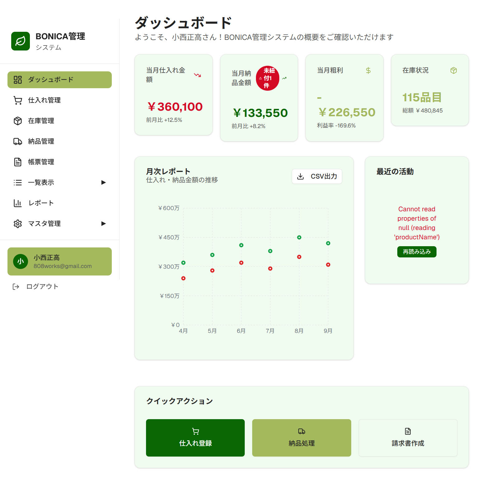
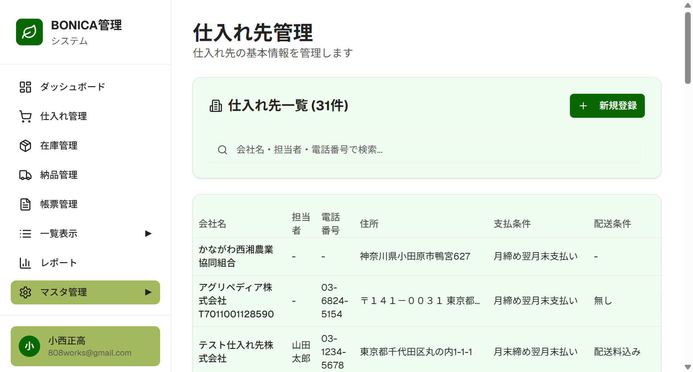

# BONICA管理システム ユーザーマニュアル

## 目次

1. [システム概要](#1-システム概要)
2. [ログイン](#2-ログイン)
3. [ダッシュボード](#3-ダッシュボード)
4. [仕入れ管理](#4-仕入れ管理)
5. [在庫管理](#5-在庫管理)
6. [納品管理](#6-納品管理)
7. [帳票管理](#7-帳票管理)
8. [レポート](#8-レポート)
9. [マスタ管理](#9-マスタ管理)

---

## 1. システム概要

BONICA管理システムは、農産物の仕入れ・納品・請求を一元管理するWebアプリケーションです。

### 主な機能
- **仕入れ管理**: 仕入れ先からの商品登録、在庫管理
- **納品管理**: 納品先への商品配送記録、納品書作成
- **請求管理**: 月次請求書の自動作成、Google Sheets連携
- **レポート**: 売上・仕入れ・粗利の分析、CSV出力

### 対応ブラウザ
- Google Chrome（推奨）
- Microsoft Edge
- Safari
- Firefox

---

## 2. ログイン

### ログイン手順

1. ブラウザで `https://bonica-system.vercel.app` にアクセス
2. メールアドレスとパスワードを入力
3. 「ログイン」ボタンをクリック

### ログアウト

画面左下のユーザー名の下にある「ログアウト」ボタンをクリックします。

---

## 3. ダッシュボード

ダッシュボードでは、システム全体の概要を確認できます。

### 表示項目

| 項目 | 説明 |
|------|------|
| 当月仕入れ金額 | 今月の仕入れ総額と前月比 |
| 当月納品金額 | 今月の納品総額と前月比 |
| 当月粗利 | 納品金額 - 仕入れ金額 |
| 在庫状況 | 在庫品目数と総額 |

### 月次レポートグラフ

過去6ヶ月の仕入れ・納品金額の推移をグラフで確認できます。

### クイックアクション

- **仕入れ登録**: 新規仕入れの登録画面へ
- **納品処理**: 新規納品の登録画面へ
- **請求書作成**: 請求書作成画面へ

---

## 4. 仕入れ管理

仕入れ先から購入した商品を登録・管理します。

### 仕入れ一覧

登録済みの仕入れデータを一覧表示します。

#### 表示項目
- 仕入れ日
- 商品名
- カテゴリー
- 仕入れ先
- 数量・単位
- 単価
- 合計金額
- 残数量
- ステータス

#### フィルタ機能
- 仕入れ先で絞り込み
- 月で絞り込み
- ステータスで絞り込み
- キーワード検索

### 新規仕入れ登録

1. 「新規仕入れ」ボタンをクリック
2. 以下の項目を入力:
   - 仕入れ先（必須）
   - 仕入れ日（必須）
   - 商品名（必須）
   - カテゴリー（必須）
   - 数量・単位（必須）
   - 単価（必須）
   - 消費期限（任意）
   - 備考（任意）
3. 「登録」ボタンをクリック

---

## 5. 在庫管理

現在の在庫状況を確認できます。

### 在庫一覧

残数量が0より大きい商品が表示されます。

#### 表示項目
- 商品名
- カテゴリー
- 仕入れ先
- 残数量
- 単位
- 単価
- 在庫金額
- 仕入れ日
- 消費期限
- 状態（良好/注意/緊急/期限切れ）

### 消費期限アラート

消費期限が近い商品は色分けで表示されます：
- **緊急（赤）**: 期限まで3日以内
- **注意（黄）**: 期限まで7日以内
- **良好（緑）**: 期限まで8日以上

---

## 6. 納品管理

納品先への商品配送を記録・管理します。

### 納品一覧

登録済みの納品データを一覧表示します。

#### 表示項目
- 納品日
- 納品番号
- 納品先
- 納品金額
- ステータス（処理中/納品完了/請求済）
- 種別（通常/赤伝）

### 新規納品登録

納品登録には3つのモードがあります。

#### 通常モード

在庫から商品を選択して納品を登録します。

**手順:**
1. 「通常モード」タブを選択
2. お客様（納品先）を選択
3. 納品日を入力
4. 左側の在庫一覧から商品をクリックして選択
5. 納品数量と単価を入力
6. 「登録」ボタンをクリック

**特徴:**
- 在庫から自動で引き落とし
- 仕入れと自動紐付け

#### 直接入力モード

仕入れデータを参照せずに直接納品情報を入力します。

**手順:**
1. 「直接入力」タブを選択
2. 納品先を選択
3. 納品日を入力
4. 商品名、カテゴリー、数量、単位、単価、税率を入力
5. 「納品登録（仕入れ未紐付け）」をクリック

**特徴:**
- 仕入れデータがなくても登録可能
- 後から仕入れと紐付け可能
- 「仕入れ未紐付け」としてダッシュボードに表示

#### 赤伝登録

返品・値引きを登録します。金額はマイナスとして計上されます。

**手順:**
1. 「赤伝登録」タブを選択
2. お客様を選択
3. 返品日を入力
4. 返品理由を入力（必須）
5. 返品商品を追加
6. 「赤伝を登録」をクリック

**特徴:**
- 金額はマイナス計上
- 請求書作成時に自動で控除
- 在庫には戻らない（廃棄扱い）

---

## 7. 帳票管理

請求書の作成と帳票履歴を管理します。

### 請求書作成タブ

月次の納品実績から請求書を作成します。

**手順:**
1. 対象月を選択
2. 「データを読み込み」ボタンをクリック
3. 顧客ごとの納品実績が表示される
4. 請求書を作成したい顧客の「請求書作成」ボタンをクリック
5. Google Sheetsに請求書が自動生成される

### 帳票履歴タブ

作成済みの請求書・納品書の履歴を確認できます。

#### 表示項目
- 帳票番号
- 種別（請求書/納品書）
- 顧客名
- 金額
- 作成日
- Google Sheetsリンク

---

## 8. レポート

過去データの分析と傾向を確認できます。

### 分析期間の設定

画面上部で分析対象期間を設定できます。

- プリセット: 今月、過去3ヶ月、過去6ヶ月、今年度、昨年度
- カスタム: 開始日・終了日を指定

### 月次レポート

月別の仕入れ・納品・粗利の推移を表示します。

#### 表示項目
- 総仕入れ金額
- 総納品金額
- 総粗利（粗利率）
- 月次推移グラフ

### 商品別分析

カテゴリー別の仕入れ・納品状況を分析します。

### 仕入れ先別

仕入れ先ごとの取引状況を分析します。

### 収益分析

利益率の推移や収益構造を分析します。

### CSV出力

画面右上の「CSV出力」ボタンから、以下のデータをCSVファイルとしてダウンロードできます：

- 月次レポート
- 仕入れ一覧
- 納品一覧
- 在庫一覧

---

## 9. マスタ管理

基本情報（マスタデータ）を管理します。

### 納品先マスタ

納品先（顧客）の基本情報を管理します。

#### 登録項目
- 会社名（必須）
- 担当者
- 電話番号
- 納品住所
- 請求先（自社請求/別の会社を指定）
- 配送時間

#### 請求先の設定

納品先と請求先が異なる場合、「請求先」に別の会社を指定できます。
請求書作成時に指定した請求先の情報が使用されます。

### 仕入れ先マスタ

仕入れ先の基本情報を管理します。

#### 登録項目
- 会社名（必須）
- 担当者
- 電話番号
- 住所
- 支払条件（例: 月締め翌月末支払い）
- 配送条件（例: 配送料込み）

### 商品カテゴリー

商品のカテゴリーを管理します。

#### 登録項目
- カテゴリー名（必須）
- 説明

### 商品プレフィックス

商品名の先頭に付ける接頭辞を管理します。

### ユーザー管理

システムを利用するユーザーを管理します（管理者のみ）。

---

## 付録

### キーボードショートカット

| ショートカット | 機能 |
|--------------|------|
| Enter | フォーム送信 |
| Escape | モーダルを閉じる |
| Tab | 次の入力欄へ移動 |

### トラブルシューティング

#### ログインできない場合
- メールアドレスとパスワードを確認してください
- CapsLockがオンになっていないか確認してください
- ブラウザのキャッシュをクリアしてみてください

#### データが表示されない場合
- ブラウザを再読み込みしてください
- インターネット接続を確認してください

#### 請求書が作成できない場合
- Google Sheets APIの認証が有効か確認してください
- 対象期間に納品データが存在するか確認してください

### お問い合わせ

システムに関するお問い合わせは、管理者までご連絡ください。

---

*本マニュアルはBONICA管理システム v1.0に対応しています*
*最終更新日: 2025年12月*
